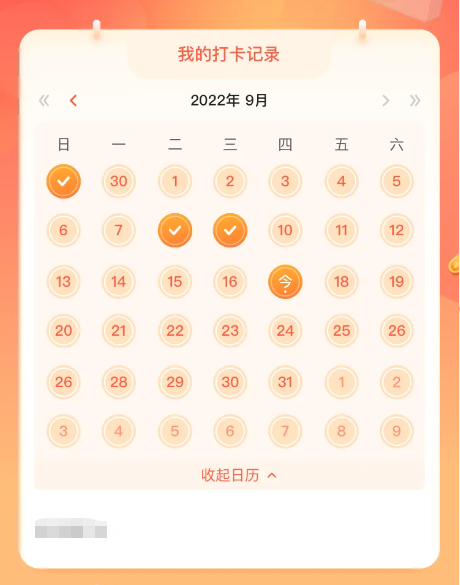
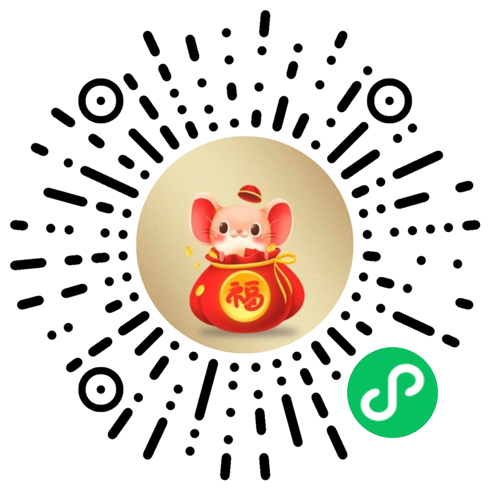

# uni-app-mini

> 由 **uniapp** 开发编译微信小程序组件（其他平台未测试）

## ✨ TODO

- [x] 🔨 calendar(日历组件)
- [x] 🔨 live(小程序自定义推流直播)

## ⚡ Effect Screenshot

## 🔍 Preview

> wechat mini name: WuChenDi

  

## ⚡ Credits

Code built with the help of these related projects:

- [uni-app](https://uniapp.dcloud.net.cn/) is a framework for developing all front-end applications using [Vue.js](https://vuejs.org/),
- [wx-calendar](https://github.com/qi-Nian-Jin-Xi/wx-calendar) is a calendar component that runs in the wechat mini program,

## 🎈 License

MIT
